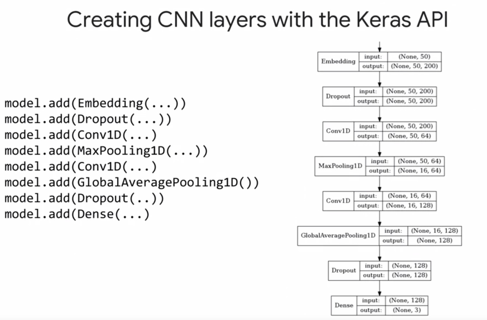

# GCP time series and NLP

## Contents

[***LSTM,GRU,RNN in TensorFlow***](https://github.com/Sylar257/GCP-time-series-and-NLP#Basic_models): primal approaches for modeling time-series data.

[***Building NLP models with Keras***](https://github.com/Sylar257/GCP-time-series-and-NLP#Building_NLP_models_with_Keras): bringing data to the cloud

[***Designing adaptable ML systems***](https://github.com/Sylar257/GCP-time-series-and-NLP#adaptable_ml_system): how to mitigate potential changes in real-world that might affect our ML system

[***High performance ML systems***](https://github.com/Sylar257/GCP-time-series-and-NLP#high_performance_ML_system): choose the right hardware and removing bottlenecks for ML systems

[***Hybrid ML systems***](https://github.com/Sylar257/GCP-time-series-and-NLP#Hybrid_ML_system): high-level overview of running hybrid systems on the Cloud


## Basic_models

The basic concepts of LSTM, GRU, and vanilla RNNs could be found in my [other repos](https://github.com/Sylar257?tab=repositories). Here we will focus on their implementation on GCP with TensorFlow:

```python
# pre-determine cell state size
CELL_SIZE = 32

# 1. Choose RNN Cell type
cell = tf.nn.rnn_cell.GRUCell(CELL_SIZE) # BasicLSTMCell: LSTM; BasicRNNCell: vanilla rnn

# 2. Create RNNby passing cell and tensor of features(x)
outputs, state = tf.nn.dynamic_rnn(cell, x, dtype=tf.float32) # x needs shape: [BATCH_SIZE, MAX_SEQUENCE_LENGTH, INPUT_DIM]
# state has shape: [BATCH_SIZE, CELL_SIZE]

# 3. Pass rnn state through a DNN to get prediction
h1 = tf.layers.dense(state, DNN, activation=tf.nn.relu)
pretidtions = tf.layers.dense(h1, 1, activation=None) #(BATCH_SIZE, 1)

return predictions
```

## Building_NLP_models_with_Keras



If we want to use `Keras` for its fast prototyping properties. Bear in mind that `Keras` does not support distributed training itself.

An common way to solve this problem is to convert `Keras` models to `keras.estimator`

```python
model = models.Squential()

# define models architecture here
...

# compile model
model.compile(...)

# convert to estimator
estimator = keras.estimator.model_to_estimator(keras_model=model)
```

